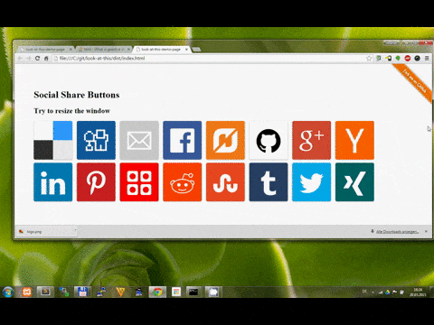

# LOOK AT THIS
[](https://travis-ci.org/s-a/look-at-this)
[](https://www.npmjs.org/package/look-at-this)
[](http://bower.io/search/?q=look-at-this)


## About
Just another social sharing plugin. Yeah o.O ... but here are the pros!

 - It is realy realy ***lightweight***. (You only need a css and js file)
 - It is ***responsive***.
 - ***Customizable link button CSS and template***.
 - It works as ***stand-alone***. No jQuery or other libs needed.
 - It respects the users ***privacy***.
 - Any additional JavaScript and CSS code is optional.


## Responsive showcase
[](https://s-a.github.io/look-at-this/dist)

## Installation

 - ```npm install look-at-this``` or ```bower install look-at-this```
 - ***Import the assets***
 - ***Add a container*** for the icons called ```#social-icons```


Take a look at examples at 
 - https://s-a.github.io/look-at-this/dist (default setup)
 - https://s-a.github.io/look-at-this/index.html

## Config networks order and visibility
To get an overview an available list is stored in ```window.socialIcons.networks``` (Array of string).  
Simply set up a ```"data-networks"``` attribute at the ```#social-icons``` container to define order and visibilty of share buttons. For example ```data-networks="email,googleplus,facebook,github,hackernews"```

## Change share url, title and so on?
By default the settings are stored like this:
```
	if (!window.socialIcons.setup){
		window.socialIcons.setup = {
			"title":document.title,
			"url":location.href
		};
	}
```
So you can set them to what you need. This informations are masked per social network in the url property at [.scream.js](https://github.com/s-a/look-at-this/blob/master/ico/.scream.js#L22) for library build. The buildjob bundles them to ```window.socialIcons.list```. 

## Custom style
There are only two CSS classes to style button layout ```.social-share-button``` and ```.social-icon```. 

## Custom Template
The output of share buttons are base on a simple template. If you need a custom template add a script block like the following to your HTML code.
``` html
	<script type="text/html" id="social_icon_template">
	  <% for ( var i = 0; i < icons.length; i++ ) { %>
		<a class="social-share-button" href="#share/<%=icons[i].name%>" target="_blank">
	 		<div class="social-icon social-icon-<%=icons[i].name%>"></div>
		</a>
	  <% } %>
	</script>
``` 


## Contributing

 - Fork it!
 - Create your feature branch: `git checkout -b my-new-feature`
 - Commit your changes: `git commit -am 'Add some feature'`
 - Run the tests: `npm test`
 - Push to the branch: `git push origin my-new-feature`
 - Submit a pull request :D


## How to add a brand?

 - Install https://github.com/s-a/scream-js
 - Add a file to ```/ico``` folder
 - Add the file entry to ```/ico/.scream.js```
 - execute ```scream .scream.js --build```
 - execute ```node bundle.js```
 - execute ```grunt build```

## License
MIT and GPL

## Credits

Icon Pack by [Dan Leech](https://github.com/danleech) at [Simple Icons](https://github.com/danleech/simple-icons)